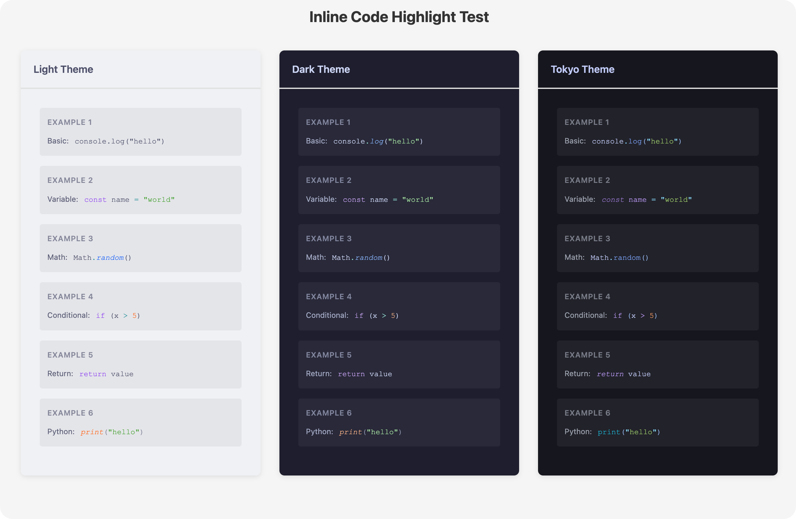

# markdown-it-inline-code

A markdown-it plugin that provides syntax-highlighted inline code using Shiki.

## Features

- 🎨 Multi-theme support (light, dark, custom themes)
- ✨ Syntax highlighting for inline code using Shiki
- 🎯 Simple syntax: `` `{lang} code` ``
- 📦 ESM and CommonJS support

## Installation

```bash
npm install markdown-it-inline-code
# or
yarn add markdown-it-inline-code
# or
bun add markdown-it-inline-code
```

## Usage

`./test/test.ts` is a simple example of how to use the plugin, Run `npm run test` and check `output` folder.

Preview of the generated HTML:



## Syntax

Use the following syntax to highlight inline code:

```markdown
`{language} code here`
```

**Example:**

```markdown
- JavaScript: `{js} console.log("hello")`
- Python: `{python} print("hello")`
- TypeScript: `{ts} const x: number = 42`
```

## Options

| Option   | Type                     | Description                                                                                                                       |
| -------- | ------------------------ | --------------------------------------------------------------------------------------------------------------------------------- |
| `themes` | `Record<string, string>` | A map of theme names to Shiki theme IDs. Default: `{ light: 'catppuccin-latte', dark: 'catppuccin-mocha', tokyo: 'tokyo-night' }` |

### Example Configuration

```typescript
import MarkdownIt from 'markdown-it'
import inlineCodeHighlightPlugin from 'markdown-it-inline-code'

const md = new MarkdownIt()

md.use(inlineCodeHighlightPlugin, {
  themes: {
    light: 'catppuccin-latte',
    dark: 'nord',
    custom: 'dracula'
  }
})
```

## Development

```bash
# Install dependencies
bun install

# Run tests and generate output
bun run test

# Build the plugin
npm run build

# Type checking
npm run check

# Linting
npm run lint
```

## License

MIT
